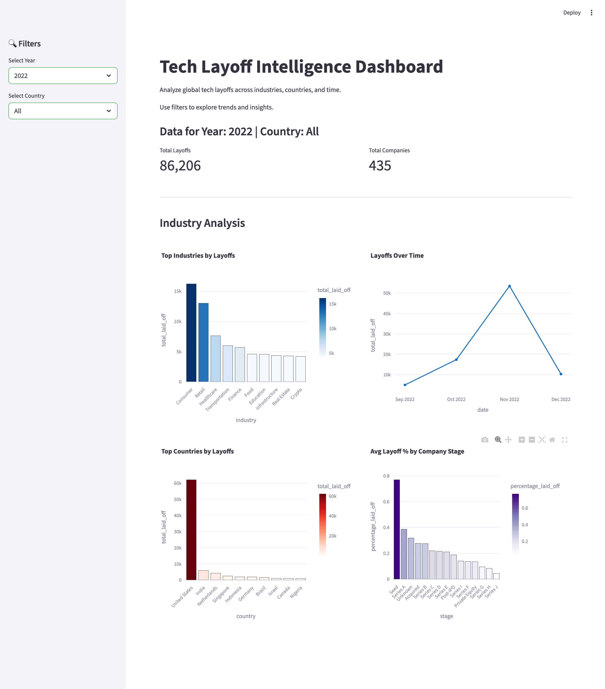

# 📊 Tech Layoff Intelligence Dashboard


Analyze global tech layoffs across industries, countries, and time using data analytics, SQL, and interactive visualizations.

---

## 🚀 Overview

This project is an end-to-end **data analytics pipeline** that explores global tech layoffs from 2020–2023.

It covers:

* Data cleaning & preprocessing
* Exploratory Data Analysis (EDA)
* SQL-based analysis
* Interactive dashboard using Streamlit

The goal is to extract meaningful insights about layoffs across industries, companies, and regions.

---

## 🧠 Key Questions Answered

* Which industries were most affected by layoffs?
* Which countries experienced the highest layoffs?
* How did layoffs change over time?
* Which companies had the largest layoffs?
* Which startup stages were most impacted?

---

## 📊 Dashboard Features

* 📅 Year-based filtering
* 🌍 Country-level filtering
* 📈 Time-series analysis (layoffs trend)
* 🏢 Industry-wise breakdown
* 🌎 Country-level insights
* 🧮 KPI metrics (total layoffs, companies affected)

---

## 🌐 Live Dashboard

👉 https://tech-layoff-analysis.streamlit.app/

---

## 📸 Dashboard Preview



---

## 🛠 Tech Stack

* **Python** (Pandas, NumPy)
* **SQL (SQLite)**
* **Plotly** (visualization)
* **Streamlit** (dashboard)
* **Jupyter Notebook** (analysis)

---

## 📂 Project Structure

```
tech-layoff-analysis/

data/
  raw/
  processed/

notebooks/
  data_cleaning.ipynb
  analysis.ipynb

sql/
  analysis_queries.sql

dashboard/
  app.py

README.md
requirements.txt
```

---

## ⚙️ How to Run the Project

### 1. Clone the repository

```
git clone https://github.com/siddhantchasta/tech-layoff-analysis.git
cd tech-layoff-analysis
```

### 2. Install dependencies

```
pip install -r requirements.txt
```

### 3. Run the dashboard

```
streamlit run dashboard/app.py
```

---

## 📈 Key Insights

* Layoffs peaked significantly in **2022**, indicating an industry-wide downturn
* **Consumer and Retail sectors** were the most affected
* The **United States** had the highest number of layoffs
* Late-stage companies (Post-IPO) showed notable workforce reductions

---

## 💡 What I Learned

* Handling real-world messy datasets
* Writing efficient SQL queries for analysis
* Building interactive dashboards for decision-making
* Structuring end-to-end data projects

---

## 🔥 Why This Project Stands Out

* Combines **Python + SQL + Visualization + Dashboard**
* Uses **real-world dataset**
* Focuses on **business insights, not just code**
* Simulates **real data analyst workflow**

---

## 📌 Future Improvements

* Add real-time data updates
* Deploy dashboard online
* Add predictive modeling (layoff forecasting)

---

## 👨‍💻 Author

Siddhant Chasta
IIT Kharagpur

---

⭐ If you found this project useful, consider giving it a star!
